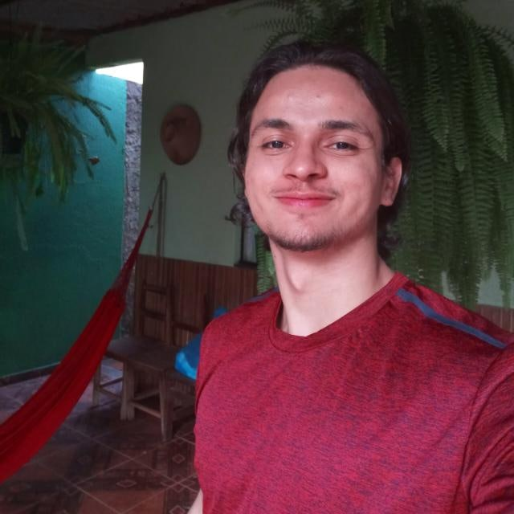

# Truco

**Disciplina**: FGA0210 - PARADIGMAS DE PROGRAMAÇÃO - T01  
**Número do Grupo**: 04 
**Paradigma**: Sistemas Multiagentes 

## Alunos
| Foto | Matrícula | Nome | GitHub |
|:--:|:--:|:--:|:--:|
| | 15/0005563 | Andre Lucas Ferreira Lemos de Souza | [@andrelucasf](https://github.com/andrelucasf) 
| | 18/0030272 | Antonio Ruan Moura Barreto | [@RuanMoura](https://github.com/RuanMoura) 
| | 18/0041444 | Brenda Vitória dos Santos | [@brendavsantos](https://github.com/brendavsantos)
| | 18/0052616 | Estevão de Jesus Reis | [@estevaoreis25](https://github.com/estevaoreis25)
| | 18/0033743 | Joao Pedro Silva de Carvalho | [@jps12](https://github.com/jps12) 
| | 18/0037439 | Sérgio de Almeida Cipriano Junior | [@sergiosacj](https://github.com/sergiosacj) 
| | 18/0028324 | Thiago Luiz de Souza Gomes| [@thiagomesUNB](https://github.com/thiagomesUNB) 
| | 18/0028685 | Victor Samuel dos Santos Lucas| [@victordsantoss](https://github.com/victordsantoss) 
| | 17/0115500 | Vinicius Vieira de Souza | [@faco400](https://github.com/faco400) 

## Sobre 
O projeto do paradigma de sistemas multiagentes visa desenvolver uma aplicação do jogo truco (com todas as regras) utilizando JADE.

## Screenshots
Adicione 2 ou mais screenshots do projeto em termos de interface e/ou funcionamento.

## Instalação 
**Tecnologias**: Java, JADE(Java Agent Development Framework) 
Descreva os pré-requisitos para rodar o seu projeto e os comandos necessários.
Insira um manual ou um script para auxiliar ainda mais.

## Uso 
Explique como usar seu projeto, caso haja algum passo a passo após o comando de execução.

## Vídeo
Adicione 1 ou mais vídeos com a execução do projeto.

## Outros 
Quaisquer outras informações sobre seu projeto podem ser descritas a seguir.

## Fontes
Caso utilize materiais de terceiros, referencie-os adequadamente.
