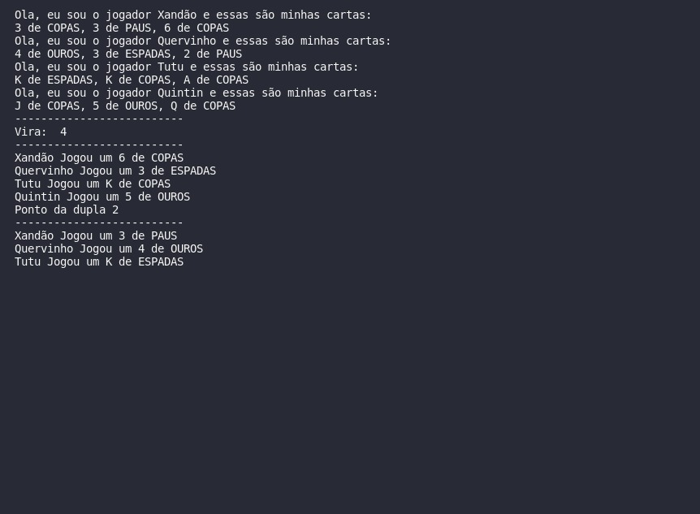
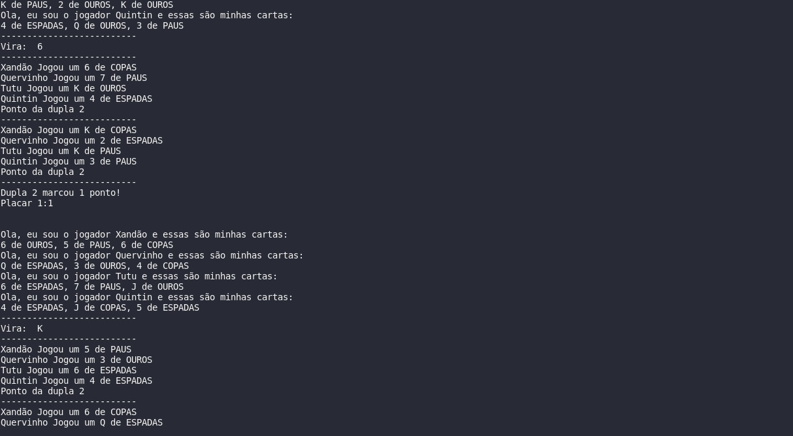
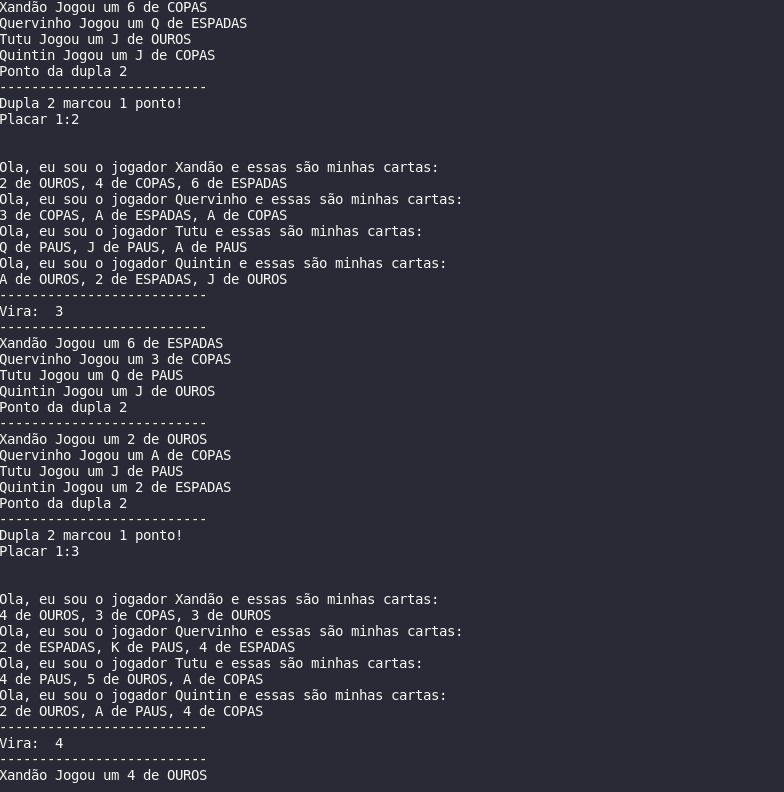
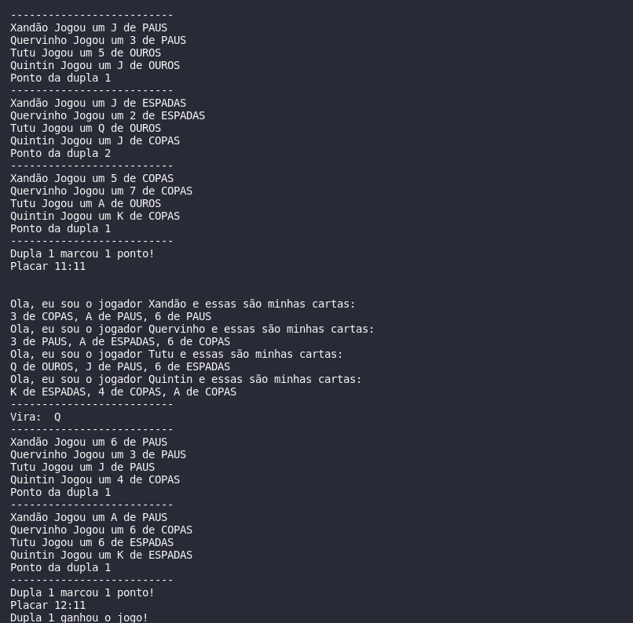

# Truco

**Disciplina**: FGA0210 - PARADIGMAS DE PROGRAMAÇÃO - T01 <br>
**Número do Grupo**: 04<br>
**Paradigma**: Sistemas Multiagentes<br>

## Alunos
| Foto | Matrícula | Nome | GitHub |
|:--:|:--:|:--:|:--:|
| | 15/0005563 | Andre Lucas Ferreira Lemos de Souza | [@andrelucasf](https://github.com/andrelucasf) 
| | 18/0030272 | Antonio Ruan Moura Barreto | [@RuanMoura](https://github.com/RuanMoura) 
| | 18/0041444 | Brenda Vitória dos Santos | [@brendavsantos](https://github.com/brendavsantos)
| | 18/0052616 | Estevão de Jesus Reis | [@estevaoreis25](https://github.com/estevaoreis25)
| | 18/0033743 | Joao Pedro Silva de Carvalho | [@jps12](https://github.com/jps12) 
| | 18/0037439 | Sérgio de Almeida Cipriano Junior | [@sergiosacj](https://github.com/sergiosacj) 
| | 18/0028324 | Thiago Luiz de Souza Gomes| [@thiagomesUNB](https://github.com/thiagomesUNB) 
| | 18/0028685 | Victor Samuel dos Santos Lucas| [@victordsantoss](https://github.com/victordsantoss) 
| | 17/0115500 | Vinicius Vieira de Souza | [@faco400](https://github.com/faco400) 

## Sobre 
O projeto do paradigma de sistemas multiagentes visa desenvolver uma aplicação do jogo truco (com todas as regras do tipo paulista) utilizando python.

## Instalação 

**Tecnologias**:   

- jupyter (Ipython interactive notebook)
- matplotlib (Python’s visualization library)
- mesa (ABM library)
- numpy (Python’s numerical python library)

A instalação é extremamente simples, após instalar git, docker e docker-compose, basta rodar o projeto usando ambos. Numa distribuição GNU/Linux, os seguintes passos são o suficiente:

```
$ git clone https://github.com/UnBParadigmas2021-2/2021.2_G4-Struct_SMA_Truco.git
$ sudo apt install docker docker-compose
$ cd 2021.2_G4-Struct_SMA_Truco/
$ docker-compose up --build
```

## O Truco Paulista

É o tipo de truco mais comum nas jogatinas, tanto online, como em competições. É utilizado um baralho com 40 cartas (exclui-se os 8, 9, 10 e os coringas) com duas duplas.

A distribuição das cartas é feita aleatoriamente, não havendo a intervenção de nenhum jogador ou membro da equipe, sendo distribuídas 3 cartas por participante.

O objetivo é marcar 12 pontos primeiro através da mão batida (uma combinação de cartas que gera no mínimo um ponto por rodada, que pode ser aumentada até 12 dependendo da aposta e das opções de cartas entre as duplas).


Cada mão é definida em três rodadas. Em cada rodada, os jogadores recebem 3 cartas, que devem ser colocadas à mesa e trocadas uns com os outros e no montante de cartas devidamente embaralhado.

No final da rodada, a combinação com maior pontuação ganha a mão.

Lembrando que Manilha é a carta mais forte da partida, depois do 3, e dos naipes, sendo a carta inicial na qual o primeiro jogador vira para cima antes do jogo começar, chamada de “Vira”. Toda combinação que levar esta carta terá uma pontuação maior no somatório final da rodada.

## Resumo das principais regras do truco paulista

- É jogado com 4 jogadores, formando 2 duplas;
- A partida de truco é chamada de queda, disputada em melhor de 3 jogos, divididas por mãos;
- Quem fizer 12 pontos vence um jogo;
- Cada mão começa valendo 1 ponto;
- A mão é dividida em melhor de três rodadas;
- Manilhas são variáveis a cada mão, a carta logo acima da Vira.
- A ordem dos naipes das manilhas é fixa: Paus, Copas, Espadas, Ouros;
- A sequência das cartas é: 3 > 2 > A > k > J > Q > 7 > 6 > 5 > 4
- Mão de onze é quando uma das duplas atinge 11 pontos. Os jogadores podem olhar as cartas um do outro antes de jogar.
- É possível disputar a mão de ferro quando empata em 11 a 11. Nesse caso, todos os jogadores disputam a mão as cegas.
- Pedir truco aumenta o valor da mão para três pontos
- Os aumentos seguintes ao truco são: seis, nove, doze e queda

## Uso 
Explique como usar seu projeto, caso haja algum passo a passo após o comando de execução.

## Screnshots








## Vídeo
Adicione 1 ou mais vídeos com a execução do projeto.

## Outros 
Quaisquer outras informações sobre seu projeto podem ser descritas a seguir.

## Fontes
* https://github.com/anthonyzutter/Truco-Jogo
* https://github.com/projectmesa/mesa/tree/main/examples
